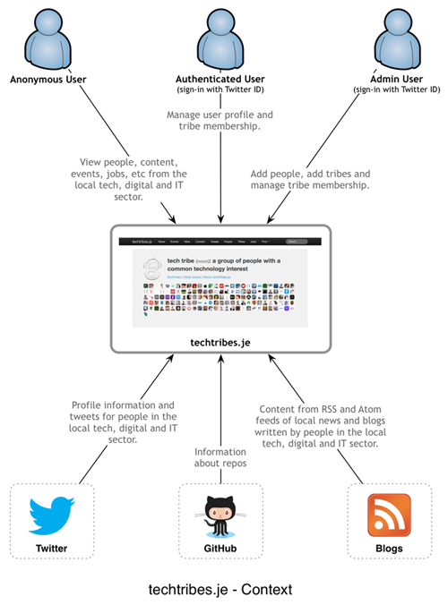

techtribesje
============

This repo contains all of the source code for the [techtribes.je](http://techtribes.je) website - the only way to keep up to date with the IT, tech and digital sector in Jersey and Guernsey, Channel Islands.



## Prerequisites

You'll need the following in order to build and run the techtribes.je website:

- [Java 7](http://www.oracle.com/technetwork/java/javase/downloads/index.html)
- [Apache Ant 1.9](http://ant.apache.org)
- [Apache Tomcat 7](http://tomcat.apache.org)
- [MySQL 5.5](http://www.mysql.com)
- [MongoDB 2.4](http://www.mongodb.org)

## Building techtribes.je

There is an Ant build script (build.xml) in the top-level directory of the repo, which can be used to compile, build and test the code. To use this script, the following environment variables must be set:

 - TOMCAT_HOME (set this to the root of your Apache Tomcat installation)
 
### Compile and run unit tests

````
ant
````

### Compile, run unit and component (integration) tests

````
ant component-tests
````

TODO: list the database schema prerequisites.

### Compile, run all tests and build a distribution ZIP

````
ant dist
````

## Running techtribes.je

TODO: list out the configuration file details.

### Running the website

### Running the standalone content updater